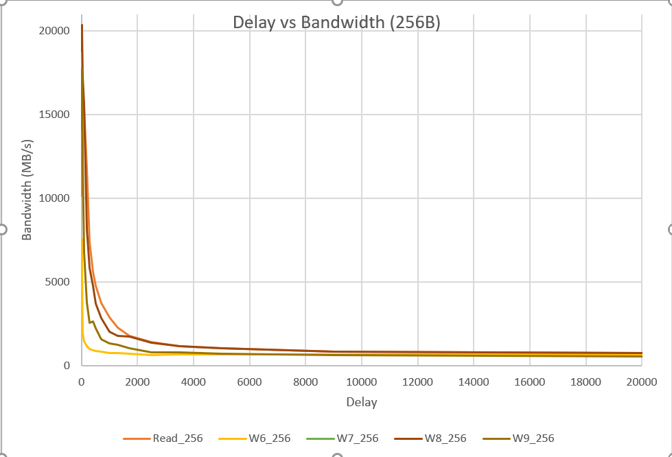
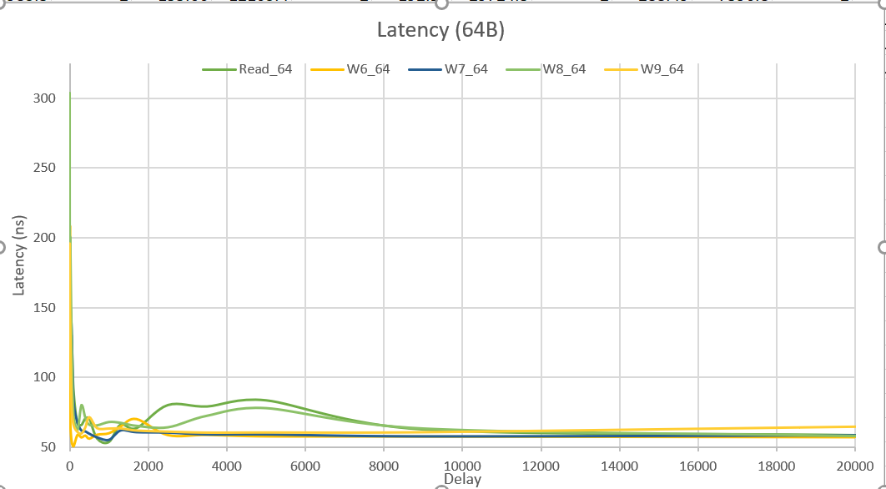
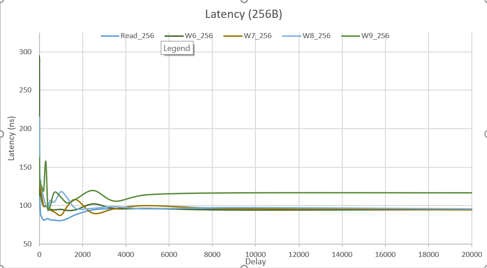

# Course Project #3: Memory and Storage Performance Profiling

The objective of this project is to develop first-hands knowledge and deeper understanding on the performance of 
modern memory and storage devices. Through the utilization of publicly available software packages like Flexible 
IO Tester (FIO) and Intel Memory Latency Checker, we were able to whitness the trade-off between access latency 
and throughput.

## Table of Contents

- [Hardware Environment](#hardware_environment)
- [Installation and Usage](#installation)
- [Results](#results)

## Hardware Environment
| CPU                  | RAM                                       | SSD                                     |
| :-------------:      | :-------------:                           | :----:                                  |
| Intel(R) Core(TM)i7-8565U CPU @ 1.80GHz | 16G SK Hynix, Part #: HMAA51S6AMR6N-UH     |     Intel SSDPEKKF512G8L         |

## Installation and Usage

To install this project, follow these steps:

1. Install the Intel Memory Latency Checker and FIO software packages on your system, if they are not already installed.
  - sudo apt-get update: make sure all package repositories are up to date
  - https://software.intel.com/content/www/us/en/develop/articles/intelr-memory-latency-checker.html
  - Download 7-Zip to extract the contents of the Memory Latency Checker
2. Create an empty partition on your SSD just for FIO testing: https://www.youtube.com/watch?v=Ej57x2WTegI

### FIO Testing
1. Make sure your working directory is the partition you just created
2. Run the following command: `sudo fio <path/to/file/filename.fio>`
### Memory Latency Testing
1. Use 7-Zip to extract the files and save the contents to your working directory, this does not have to be done in a seperate partition.
2. Look at the contents of  `memoryResults` to see the command(s)

## Results

Brief description of results

### Memory Latency Testing Results

Brief description of findings

#### Figures

