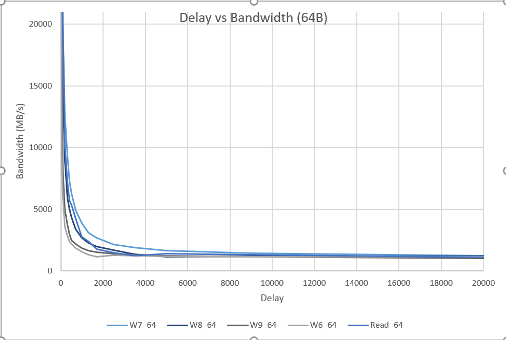
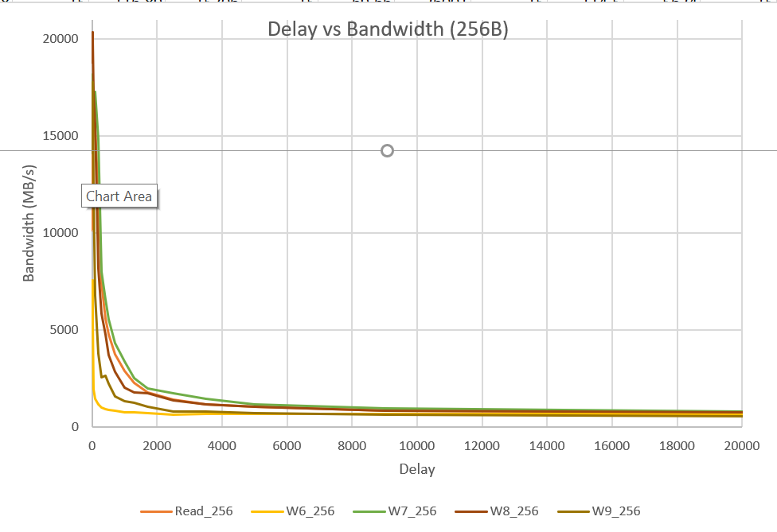
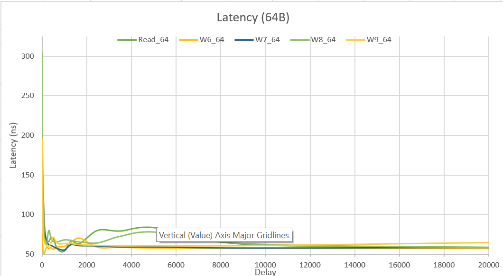

# Course Project #3: Memory and Storage Performance Profiling

The objective of this project is to develop first-hands knowledge and deeper understanding on the performance of 
modern memory and storage devices. Through the utilization of publicly available software packages like Flexible 
IO Tester (FIO) and Intel Memory Latency Checker, we were able to whitness the trade-off between access latency 
and throughput.

## Table of Contents

- [Hardware Environment](#hardware_environment)
- [Installation and Setup](#installation)
- [Testing and Results](#results)
- [Analysis](#analysis)
- [Intel Enterprise-Grade SSD Comparison](#Intel_Enterprise-Grade_SSD_Comparison)

## Hardware Environment

### Local Machine
| CPU                  | RAM                                       | SSD                                     |
| :-------------:      | :-------------:                           | :----:                                  |
| Intel(R) Core(TM)i7-8565U CPU @ 1.80GHz | 16G SK Hynix, Part #: HMAA51S6AMR6N-UH     |     Intel SSDPEKKF512G8L         |

### Ubuntu Environment
| Distributor ID  | Description | Release | Codename  |
| --- | --- | --- | --- |
| Ubuntu  | Ubuntu 20.04.1 LTS  | 20.04 | focal |

## Installation and Setup

To install this project, follow these steps:

1. Install the Intel Memory Latency Checker and FIO software packages on your system, if they are not already installed.
  - sudo apt-get update: make sure all package repositories are up to date
  - https://software.intel.com/content/www/us/en/develop/articles/intelr-memory-latency-checker.html
  - Download 7-Zip to extract the contents of the Memory Latency Checker
2. Create an empty partition on your SSD just for FIO testing: https://www.youtube.com/watch?v=Ej57x2WTegI

### FIO Setup
1. Make sure your working directory is the partition you just created
2. Run the following command: `sudo fio <path/to/file/filename.fio>`
### Memory Latency Setup
1. Use 7-Zip to extract the files and save the contents to your working directory, this does not have to be done in a seperate partition.
2. Look at the contents of  `memoryResults` to see the command(s)

## Testing and Results

Brief description of results

### Memory Latency Testing Results

Brief description of findings

#### Figures

### FIO Testing Results

Brief Description of Results

#### Figures

| Job | Operation  | IO Depth |  Block Size  | IOPS | Bandwidth | Latency |
| --- | --- | --- | --- | --- | --- | --- |
| 1 | randread |  128 | 4KB | 551k |  2151MiB/s | avg=5.43us  |
| 2 | randread |  128 | 32KB | 451k  |  13.8GiB/s  |  avg= 7.17us |
| 3 | randread |  128 | 128KB  | 233k | 28.5GiB/s  |  avg=15.54us  |
| 4 | randwrite | 128 | 4KB | 385k | 1502MiB/s |  avg= 7.96us |
| 5 | randwrite | 128 | 32KB  | 270k  | 8431MiB/s | avg=12.30us |
| 6 | randwrite | 128 | 128KB | 143k  | 17.4GiB/s | avg=25.73us |
| 7 | rw 70:30  | 128 | 4KB | r:453k, w:195k | r:1768MiB/s, w:761MiB/s  | r:4.49us, w:avg= 4.91us  |
| 8 | rw 70:30  | 128 | 32KB | r:322k, w:139k | r:9.83GB/s, w:4543MB/s  | r:6.88us, w:avg= 7.60us  |
| 9 | rw 70:30  | 128 | 128KB | r:154k, w:66.5k | r:18.8GiB/s, w:8721MB/s  | r:15.78us, w:avg=18.16us  |
| 10 | randread |  256 | 4KB | 652k |  2671MB/s | avg=4.55us  |
| 11 | randread |  256 | 32KB | 466k  |  15.3GB/s  |  avg= 6.97us |
| 12 | randread |  256 | 128KB  | 232k | 30.4GB/s  |  avg=15.66us  |
| 13 | randwrite | 256 | 4KB | 379k | 1552MB/s |  avg= 8.03us |
| 14 | randwrite | 256 | 32KB  | 291k  | 9523MB/s | avg=11.46us |
| 15 | randwrite | 256 | 128KB | 151k  | 19.7GB/s | avg=24.38us |
| 16 | rw 70:30  | 256 | 4KB | r:419k, w:180k | r:1717MB/s, w:738MB/s  | r:4.81us, w:avg= 5.22us  |
| 17 | rw 70:30  | 256 | 32KB | r:320k, w:138k | r:10.5GB/s, w:4515MB/s  | r:6.90us, w:avg= 7.70us  |
| 18 | rw 70:30  | 256 | 128KB | r:156k, w:67.3k | r:20.4GB/s, w:8817MB/s  | r:15.54us, w:avg=18.01us  |

## Analysis

Brief Description of Analysis

### Memory Latency Checker Analysis
This data represents the performance of a storage system for sequential reads of 64-byte / 256-byte blocks with varying delay times. The data shows the relationship between delay (latency) and throughput (MB/sec).

The data indicates that as the delay increases, the latency decreases and the bandwidth increases up to a certain point. After that point, further increase in delay leads to a decrease in bandwidth. At very high delay times, the storage system becomes a bottleneck and can no longer keep up with the incoming requests, resulting in decreased throughput.

Therefore, there is a tradeoff between latency and throughput, and the optimal delay time depends on the specific storage system and workload. The optimal delay time occurs where the system achieves the highest throughput.

### FIO Analysis
We can see from the data that as the block size increases, the IOPS decreases, but the bandwidth increases. Larger block sizes allow more data to be transferred at once, which increases the amount of data that can be transferred per second. However, larger block sizes also mean that it takes longer to transfer each block, which reduces the number of blocks that can be transferred per second (IOPS).

We observe that as the block size increases, the latency also increases. This is because larger block sizes take longer to transfer, which increases the amount of time it takes for each operation to complete. However, we can also see that as the block size increases, the throughput (measured in IOPS or bandwidth) also increases, which means that more data can be transferred per second.

Overall, this data highlights the tradeoff between latency and throughput. Increasing the block size can increase the throughput (the amount of data that can be transferred per second), but it can also increase the latency (the amount of time it takes for each operation to complete). The optimal block size depends on the specific use case and the desired balance between latency and throughput.

## Intel Enterprise-Grade SSD Comparison
