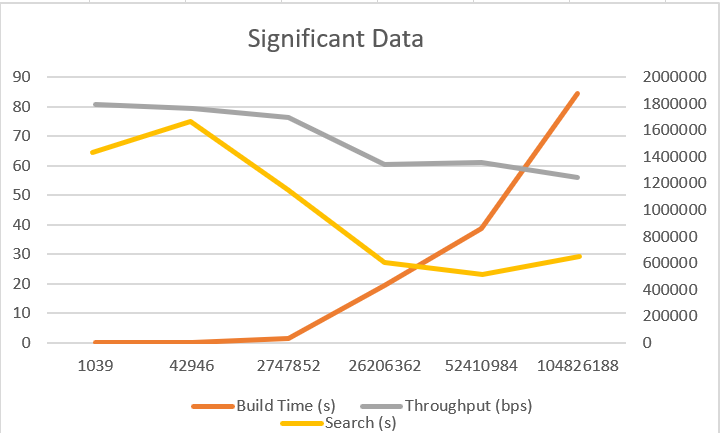

# CPU Microcontroller Dictionary Encoding Comparison

For this project we decided to compare an intel CPU in a regular laptop, and a 700 MHz ARM1176JZF-S core processor in a raspberry pi microprocessor. We implemented a B-tree and compared the time it takes to construct the B-tree as well as the time it takes to retreive information. We used intrinsic instructions to compare the time difference between a naive and accelerated implementation. Ultimately, we expected and observed the raspberry pi to pale in comparison to the intel CPU.

## Installation and Environment

To Install please make sure that you have downloaded the full folder

### Raspberry Pi Zero W
| | |
|---|---|
|processor       | 0 
|model name      | ARMv6-compatible processor rev 7 (v6l)
|BogoMIPS        | 697.95
|Features        | half thumb fastmult vfp edsp java tls
|CPU implementer | 0x41
|CPU architecture| 7
|CPU variant     | 0x0
|CPU part        | 0xb76
|CPU revision    | 7
|Hardware        | BCM2835
|Revision        | 9000c1
|Serial          | 00000000e0e347c5
|Model           | Raspberry Pi Zero W Rev 1.1|

### Razer Blade 17

Processor	11th Gen Intel(R) Core(TM) i7-11800H @ 2.30GHz, 2304 Mhz, 8 Core(s), 16 Logical Processor(s)

## Compilation

Use the following command to compile the program

```
 g++ -mavx -march=native -mfpmath=both -O3 B-tree_computer.c -o b.out
```
## Execution

Once you have compiled you may run with the command
```
./a.out <inputfile> <searchItem>
```
we have provided smallFile.txt and bigFile.txt for ease of use, but our code will work with any column file of integers

## About the Code

A B-tree is a data structure commonly used for storing and retrieving large amounts of data efficiently. It is a self-balancing tree data structure that allows for efficient searching, insertion, and deletion operations. We use SIMD instructions to accelerate the search function on the Intel machine. The most common SIMD instruction set for ARM processors is NEON, but the raspberry pi zero w does not support NEON as seen in the `Instalation and Environment` section. Though it does support vfp, without NEON we cannot access VFP instructions in C, the commands would have to be written in assembly. 

## Code Structure
The code is a C program that implements a B-tree data structure for searching and inserting keys. The code defines a structure for the B-tree node and includes functions for creating a new node, inserting a new key into the tree, splitting a node, and searching for a key in the tree. Additionally, the code includes an optimized search function using AVX instructions for faster searching. The code structure defines various constants and includes standard C libraries for memory allocation, file operations, and time management. The code is organized in a series of functions that perform specific tasks, and there is a main function that calls these functions to implement the B-tree.
- insertNode(): inserts a new value and child node at a given position
- splitNode(): splits a B-tree node in half and returns a new node with the higher values
- setValue(): sets by recursively traversing the tree until the appropriate node is found, and then inserting the value in the correct position
- search(): searches for a value in the B-tree by recursively traversing the tree until the value is found

The big difference between the AVX accelerated instructions and the normal instructions is that the AVX instruction read a few sequential nodes into a vector and uses a bitmask to compare the downstream nodes to the search term allowing in special cases to "jump" ahead of the search and in fail cases to just do node comparasons faster as you can compare whole nodes in significanly fewer cycles

## Testing and Analysis

For the raspberry pi, we obtained the following results:

|File Size (b)|	Build Time (s)|	Throughput (bps)|	Search (s)|
|---|---|---|---|
1039	|0.000578	|1797577.855	|0.000038|
42946	|0.0234337	|1764638.205	|0.000043|
2747852	|1.622796	|1693282.458	|0.000032|
26206362	|19.506398	|1343475.202	|0.00002|
52410984	|38.622619	|1357002.331	|0.000018|
104826188	|84.337217	|1242941.038	|0.000021|

The search algorithm we used has a time complexity of O(log n). This means that as the size of the data set increases, the time taken to search for a particular element using this algorithm will increase, but not as quickly as it would with a linear search algorithm, which has a time complexity of O(n). As a result, it is strange and unclear why increasing the size of the data set would result in a decrease in search time.

For the computer we obtained the following results

|# of entries |	Search time AVX (us)|	Search time (us)| Throughput (Mbps) |
|---|---|---|---|
|500000	|1	|2	| 2.57 |
|5000000	|1	|4	| 2.78 |
|10000000	|2	|42	| 54.28 |


## Conclusion
Based on our testing and analysis, we can conclude that the Raspberry Pi is much less efficient at storing and retrieving information from a B-tree than an Intel CPU in a regular laptop. The Raspberry Pi's lack of support for SIMD instructions, specifically NEON, hinders its ability to perform optimized searches. This limitation ultimately makes it an illegitimate comparison to an Intel CPU when it comes to B-tree performance. 

For the Computer based compression program the larger amount of memory and the faster clock means that the program runs much faster on a laptop cpu. The laptop also come with the addtion of some SIMD acceleration which allows it to vastly outpreform the microcontroller based program. Compared to the completely optimized Palm tree the regualr B+-tree still underpreforms, but the techniques and locking mechanisms required to implement the improved version I judged to be beyond my skill and the expected scope of the class.
